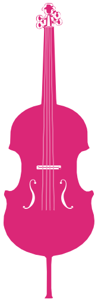
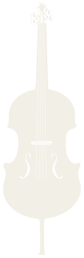

# CELLO — Logo Assets

This folder is the **single source of truth** for the CELLO logo. If you are an agent or
developer adding the logo to any surface — the corporate site, the portal (`cello-portal`),
social, a favicon, an email — everything you need is here. You should not need to redraw or
re-derive anything.

**Fastest path:**
- React / Next app → copy `CelloLogo.tsx`, `import { CelloLogo, CelloMark }`.
- Anything else (plain HTML, email, design tool, favicon) → use the `.svg` files.
- Want to see it first → open `preview.html` in a browser.

---

## What the logo is

A filled, single-color illustration of a cello (the instrument) set beside the word
**“Cello”** in **Lora** (serif), with the capital **C** in the brand pink and the rest in
warm white. The cello mark has open f-holes, strings, and scroll detail — these are real
holes in the shape (`fill-rule: evenodd`), so the background always shows through.

There are **two approved lockups**. Both are correct; pick per context:

| Variant | Looks like | Use when |
|---|---|---|
| **BACK** (primary) | word first, cello leaning on the final **o** (−18°) | default — headers, marketing, most places |
| **FRONT** (alternate) | cello leaning against the capital **C** (+22°), word after | when you want the instrument to lead, or for variety |

And a **mark only** (the cello with no text) for square spots: favicon, app icon, avatar,
tight nav.

---

## Files

| File | What it is |
|---|---|
| `cello-mark.svg` | The cello instrument alone. `fill="currentColor"` → recolors with CSS `color`. Tight crop. **The atom everything is built from.** |
| `CelloLogo.tsx` | Self-contained React component. No external assets, no font files. Exports `CelloLogo` (full lockup), `CelloMark` (instrument only), and `CELLO_PATH` (raw path data). |
| `preview.html` | Open in a browser — shows both lockups at several sizes, the mark in each color, and on light/dark. Also a copy-paste reference. |
| `assets/cello-mark-pink.svg` | Mark pre-filled brand pink (`#db2777`) for `` use. |
| `assets/cello-mark-cream.svg` | Mark pre-filled warm white (`#F2EFE6`) for `` use. |
| `assets/*.png` | Rendered raster previews of the lockups/mark on the dark brand background, for places that can't take SVG. |

---

## Colors

| Token | Hex | Used for |
|---|---|---|
| Brand pink | `#db2777` | the capital **C**; the mark when used as a bold accent |
| Warm white | `#F2EFE6` | the rest of the word (“ello”); the mark on dark backgrounds |
| (light-pink) | `#f084b6` | optional softer accent |
| Ink (on light bg) | `#211c1d` | the word + mark when placed on a light/cream background |

In the **portal**, these already exist as CSS variables — prefer them so the logo tracks the theme:

```
--cello-primary  →  #db2777   (the C / pink mark)
--text-000       →  #F2EFE6-ish warm white (the word / cream mark)
```

`CelloLogo.tsx` already references `var(--cello-primary, #db2777)` and
`var(--text-000, #F2EFE6)`, so dropping it into the portal needs no color wiring.

---

## Typography

- Font: **Lora** (Google Fonts). Capital **C** = weight **500**; “ello” = weight **400**.
- Letter-spacing: `-0.01em`. Line-height: `1`.
- The portal already loads Lora as `--font-lora`. For other apps, load it:
  ```html
  <link href="https://fonts.googleapis.com/css2?family=Lora:wght@400;500&display=swap" rel="stylesheet">
  ```
- The **mark** (`cello-mark.svg`) needs **no font** — it is pure vector. Only the full
  lockup uses Lora. If you cannot guarantee Lora is present and need a fixed-forever image,
  use a PNG from `assets/` (or ask for an outlined SVG).

---

## How to use

### React / Next (portal, corporate site)

```tsx
import { CelloLogo, CelloMark } from "./CelloLogo"; // adjust path

// primary lockup, sized by fontSize
<CelloLogo fontSize={40} />

// alternate lockup
<CelloLogo variant="front" fontSize={40} />

// instrument only (favicon-ish / nav)
<CelloMark size={28} color="var(--cello-primary, #db2777)" />
```

Everything scales from `fontSize` (the cello stays glued to the word). Colors default to the
brand, override with `markColor` / `cColor` / `wordColor` if needed (e.g. on a light page).

### Plain HTML / inline SVG (recolorable)

```html
<!-- the mark inherits the CSS color of its container -->
<span style="color:#db2777">
  <svg viewBox="211.58 30.59 165.58 506.16" height="28" aria-label="Cello">
    <use href="cello-mark.svg#... "/>  <!-- or paste the <path> from cello-mark.svg -->
  </svg>
</span>
```
Simplest: open `cello-mark.svg`, copy its `<path>`, inline it, and set `fill` (or
`fill="currentColor"` + a `color`).

### `` / favicon / email / design tools

```html


```
For a full-lockup static image where you can't run code or load Lora, use `assets/*.png`.

### Recoloring

`cello-mark.svg` is `currentColor`. Inline it and set `color` (CSS) or `fill` (attribute).
One color drives the whole instrument; the f-holes / strings / scroll stay open because they
are real holes (`fill-rule: evenodd`) — don't "fill them in."

---

## Sizing & spacing

- **Minimum sizes:** lockup reads down to ~22px font-size; the mark reads down to ~16px,
  though fine scroll detail softens below ~24px. For favicons ≤16px, the silhouette still
  reads as a string instrument.
- **Clear space:** keep padding around the lockup of at least the cap-height of the “C”.
- **Don't:** stretch, rotate the lockup, change the lean angles, recolor the C to anything
  but the pink/ink, add effects/shadows, or fill the f-holes.

---

## Geometry (for anyone rebuilding or animating)

- Cello mark viewBox (tight): `211.58 30.59 165.58 506.16`. Inside the lockup it sits in a
  padded box `208 30 172 508` (the padding is what produces the approved spacing).
- Cello height in the lockup = `1.5em` (relative to the word's font-size).
- BACK: cello rotated **−18°**, pivot `transform-origin: 50% 100%` (the endpin), placed
  right after the word with no extra margin → rests on the “o”.
- FRONT: cello rotated **+22°**, same pivot, `margin-right: 0.0865em` before the word → rests
  against the “C”.

---

*Generated during the 2026-06-29 logo design session. If you change the mark or the lockup
geometry, regenerate `CelloLogo.tsx`, `cello-mark.svg`, and `preview.html` together so they
stay in sync.*
